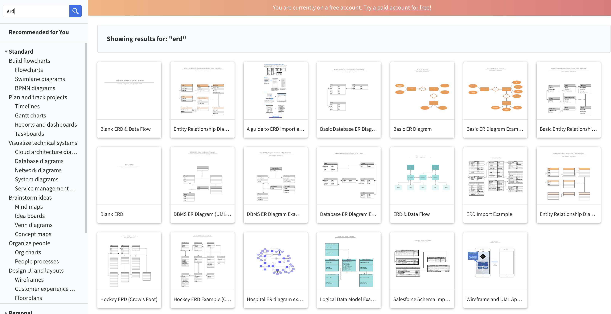

## Lucid Chart

### 학습 계기

원래는 keynote나 powerpoint, sketch app 등으로 다이어 그램을 그리곤 했다. 그러다, 이를 더 쉽고 체계적으로 그릴 수 있는 도구들에 대해 알아보게 되었고 lucid chart를 알게 되었다. 

특히 lucid chart의 경우 [별도의 유트브 채널](https://www.youtube.com/user/lucidchart/)이 있어 도구 활용법을 쉽게 접할 수 있었다. (그리고 무려 32만명의 구독자를 보유중이다)

Lucid chart는 단순히 ERD를 그리기 위한 도구로 알아 봤는데, 예상과 달리 굉장히 많은 그리기 도구를 제공한다. 특히 나의 입장에서는 여러 템플릿들이 존재하여 더욱 쉽게 시작할 수 있었다. 

lucid chart는 너무나도 직관적이고 사용이 편리하여 그 방법을 기록하지 않아도 될것 같다. 

하지만, 여러 종류의 다이어 그램이 처음인 사람들을 위해 좋았던 영상 몇가지 링크를 달아보겠다. (좋아요 비율이 굉장히 높다!)

### UML Class Diagram Tutorial

[UML Class Diagram Tutorial 링크](https://youtu.be/UI6lqHOVHic)

객체지향을 처음 학습하며, 관계를 표현하기 위해 UML이라는 것을 처음 접하게 되었고, 이에 대해 너무 쉽고도 핵심적인 내용만 짚어준 영상이다. 누구라도 한번 시청하면 바로 다이어 그램을 그릴 수 있을 정도다. 

### UML Use Case Diagram Tutorial

[UML Use Case Diagram Tutorial 링크](https://youtu.be/zid-MVo7M-E)

항상 글(리스트)로만 작성하였던 유즈케이스가 이렇게 다이어그램으로 표현이 용이할 수 있다는 것을 느꼈다. 이런 내용을 배운적이 없어서 그런지, 표현하는 다양한 방법에 대해 더 알아볼 필요가 있겠단 생각이 들었다.

### How to Make a UML Sequence Diagram

[How to Make a UML Sequence Diagram 링크](https://youtu.be/pCK6prSq8aw)

OAuth 2.0등을 학습하며, 항상 봐왔던 형식의 다이어 그램이였다. 이것을 나는 keynote로만 그릴려 했었는데, 항상 꾸미는데 시간이 더 들더라...
이렇게 쉬운 도구로 직관적으로 표현할 수 있다는 점에 적절한 도구의 중요성을 알게 되었다. 위의 다른 UML 예시와 마찬가지로, 여러 종류의 다이어 그램에 대해 더 알아볼 필요성을 느끼게 되었다. 

### 플레이리스트

이 외에도 lucid chart에서 제공하는 관련 플레이 리스트속의 영상을 모두 시청해 보면, 입문자의 입장에서 큰 도움이 될것 같다. 항상 혼자 개발을 할 때는 이러한 직관적인 의사소통의 수단(다이어그램)이 중요한지 몰랐다. 그러나, 누군가와 협업하기 위해서는 이만한 도구가 없는 것 같다. 좋은 사람들과 함께 하기 위해 더욱 더 노력해야 겠다. 

[Diagramming Tutorials 플레이 리스트](https://www.youtube.com/playlist?list=PLUoebdZqEHTwbYD8oo6Wr81Xb7uCAh_oz)